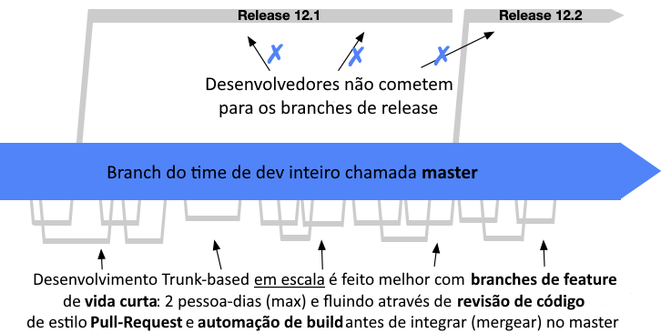

# Desenvolvimento Baseado no Tronco:  Céu, Terra e Purgatório

---
# Branch Master ou Tronco (Céu)

- Branch principal cujo Head sempre possa possa ser colocado diretamente em produção
- É o Branch dos códigos perfeitos

---

# Padrões para Saúde do Tronco

- Padrão de codificação, como um dos [padrões de codificação do Google](https://google.github.io/styleguide/)
  - Padrão PEP 8
  - Docstrings
  - Anotações de tipos
- Código de auto-teste
- Revisão pré-integração

---
# Pontos Principais do Padrão [PEP 8](https://peps.python.org/pep-0008/)

- Leiaute do código
  - Indentação
  - Comprimento de linha máximo
  - Linhas em branco
  - Importações
- Convenções de nomenclatura

---
# Docstrings

- [Docstrings padrão Google](https://google.github.io/styleguide/pyguide.html#s3.8-comments-and-docstrings)
  - Podem ser extraídas automaticamente e são usadas por Sphinx  (rodar Sphinx para [ver como ficam](https://spark-tests.readthedocs.io/en/latest/))
- Modules
- Classes
- Funções e métodos  exceto as que atendam cumulativamente:
    - não visível externamente
    - muito curta
    - óbvia

---
# Anotações de Tipos

- Pelo menos anotar as APIs públicas
- Usar julgamento para chegar a um bom equilíbrio entre segurança e clareza por um lado, e flexibilidade por outro
- Anotar código que é propenso a erros relacionados ao tipo (bugs anteriores ou complexidade)
- Anotar códigos difíceis de entender
- Anotar código a medida que se torna estável do ponto de vista dos tipos
  - Pode-se anotar todas as funções de um código maduro sem perder muita flexibilidade

---
# Código de Auto-teste

- A medida que escrevemos o código de produção, também escrevemos um conjunto abrangente de testes automatizados para que possamos ter certeza de que o código não conterá bugs
  - É normal o código de testes ser maior do que o código de produção
- Assim podemos manter o Branch saudável executando uma compilação com cada Commit, essa compilação inclui a execução deste conjunto de testes
- Caso o sistema falhe ao compilar ou os testes falhem, nossa prioridade número um é corrigi-los antes de fazermos qualquer outra coisa nesse Branch
  - Muitas vezes isso significa "congelar" o Branch: nenhum Commit é permitido a ele além de correções para torná-lo saudável novamente

---
# Revisão Pré-integração

- Cada Commit para o tronco é revisado por pares antes que o Commit seja aceito
- Encaixa-se particularmente bem com o mecanismo de Pull Requests
- A prática se espalhou amplamente nas maiores empresas de tecnologia
  - Google e Facebook constroem ferramentas especiais para ajudar a fazer isto funcionar sem problemas
- É importante desenvolver a disciplina para Revisões Pré-integração no prazo
  - Mesmo quando bem feito, as Revisões Pré-integração sempre introduzem alguma latência no processo de integração
  - Quando usado com Integração Contínua, o prazo para Revisão Pré-integração não pode exceder a **um dia**

---
# Git-flow

---
# Branch Develop (Terra)

- Branch principal cujo Head sempre reflete um estado com as últimas mudanças de desenvolvimento para a próxima versão
- É o Branch dos códigos imperfeitos

---
# Branch Release (Purgatório)

- Um Branch Release típico copiará do Branch Develop atual, mas não permitirá a adição de novos features
- Os desenvolvedores trabalhando no Branch de Release se concentram apenas em **retrabalhar** o código para remover as imperfeições que impeçam o Merge ao Tronco
  - Quaisquer correções a estas imperfeições são criadas no Branch de Release e mergeadas ao Branch Develop
  - Quando não houver mais imperfeições a serem retrabalhadas, o Branch estará pronto para o Merge ao Tronco

---
# Fogo do Purgatório

- Os desenvolvedores que fazem o retrabalho na maioria das vezes não são os mesmos que desenvolveram o código
- Algumas vezes o retrabalho é maior do que o trabalho feito no desenvolvimento do código original
- Fica cada vez mais difícil fazer merge de volta ao Branch Develop com o passar do tempo
  - Os branches inevitavelmente divergem, portanto, à medida que mais Commits modificam o Branch Develop, fica mais difícil fazer os merges do Branch Release ao Branch Develop

---
# Desenvolvimento Baseado no Tronco

