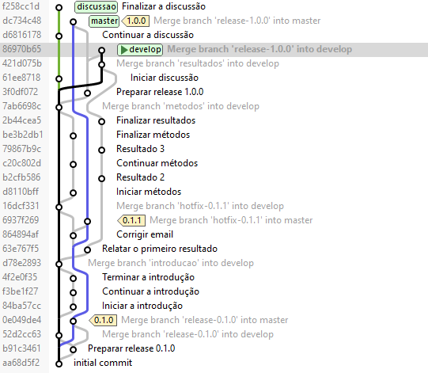
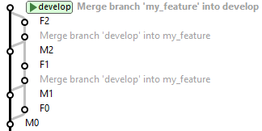

## Resumo

## Introdução

O branching é considerado o feature matador do Git, permitindo que milhares de desenvolvedores trabalhem em paralelo sobre uma mesma base de código. No entanto, apesar do Git facilitar muito, o processo básico continua sendo o mesmo: cada desenvolvedor trabalha em uma cópia privada da base de código. Agora os desenvolvedores podem facilmente trabalhar em seus próprios features, mas surge um problema: como juntar as cópias novamente ao final do trabalho? 

Os desafios com esse processo são os **conflitos de merge**. Estudo de Brindescu et al. [@brindescu2020planning] mostra que os conflitos de merge são prevalentes: cerca de 20% de todos os merges acabam em um conflito de merge.

Os conflitos de merge podem ser classificados em três tipos conforme a forma de sua detecção, por ordem crescente de dificuldade:

1. O **conflito textual** ocorre quando os desenvolvedores modificam os mesmos arquivos de código em paralelo. Este é o conflito que é detectado automaticamente pelo Git, mas requer intervenção humana para sua resolução;

2. O **conflito semântico estático** ocorre quando as falhas aparecem na análise do programa estática, por exemplo, na compilação;

3. O **conflito semântico dinâmico** é o mais insidioso e dificultoso, ocorre quando as falhas aparecem somente em tempo execução. Esse conflito pode ser detectado por um teste que reproduza as condições da falha.

Os conflitos de merge têm impacto na qualidade do código, são perturbadores para o fluxo de trabalho de desenvolvimento. Para resolver um conflito de merge, um desenvolvedor tem que parar o que está fazendo e focar na resolução. Resolver um conflito requer que o desenvolvedor entenda as mudanças conflitantes, crie uma solução de consenso que satisfaça ambos os conjuntos de requisitos que impulsionaram as mudanças. Não há como criar um algoritmo para resolver conflitos automaticamente. Muitos times gastam uma quantidade excessiva de tempo lidando com seu emaranhado de branches.

Esses fatores podem levar os desenvolvedores a adiar a resolução do conflito ou “empurrar o problema com a barriga”, especialmente no caso do conflito semântico dinâmico. De fato, um estudo de Nelson et al. [@nelson2019life] descobriu que 56.0% dos desenvolvedores adiaram pelo menos uma vez resolver um conflito de merge. No entanto, quanto mais tarde um conflito for resolvido, mais difícil é recordar a lógica das mudanças, o que torna o processo de resolução muito mais difícil [@fowler2006ci]. Como apropriadamente colocado por um participante do estudo de Nelson et al.:

> Adiar um conflito de merge é simplesmente empurrar o problema com a barriga (para um precipício). Geralmente, a resolução do conflito só fica mais difícil com o passar do tempo

O estudo de Brindescu et al. [@brindescu2020planning] descobriu os principais fatores que influenciam a dificuldade dos conflitos de merge:

* **Complexidade** das linhas de código em conflito: quando mais complexo maior a dificuldade dos conflitos de merge;
* **Modularidade**: se um sistema tem bons módulos, então, na maioria das vezes, os desenvolvedores estarão trabalhando em partes bem separadas da base de código, suas mudanças não causarão conflitos;
* **Tamanho dos branches** (número de linhas de código modificadas ou adicionadas): quando dobramos o tamanho dos branches, o valor esperado e a incerteza da dificuldade dos conflitos de merge (pessoa-horas) quadruplica aproximadamente.

Neste artigo apresentamos diversos workflows que suportam o desenvolvimento em paralelo propiciado pelo Git, mas buscando minimizar a dificuldade dos conflitos de merge:

* Git-flow
* OneFlow
* GitHub Flow
* Trunk-based Development

A ideia chave é o conceito de **deslocamento à esquerda** [@forsgren2016devops]. Quando deslocamos para esquerda, menos coisas quebram na produção, porque quaisquer problemas são detectados e resolvidos mais cedo.

Pense no processo de entrega de software como uma linha de montagem de fabricação. A extremidade esquerda é o laptop do desenvolvedor onde o código se origina, e extremidade direita é o ambiente de produção onde esse código será implantado. Quando deslocamos para esquerda, em vez de testar a qualidade apenas no final, temos vários loops de feedback ao longo do caminho para termos problemas menores de resolução mais fácil.

## Git-flow

Git-flow tornou-se um dos workflows mais populares. Foi escrito por Vicent Driessen em 2010 [@driessen2010gitflow], aparecendo quando o Git estava ficando popular. Nos dias anteriores ao Git, branching era frequentemente visto como um tópico avançado. Em comparação com o desajeitado Subversion, o Git tinha branching "leve". Isto facilitou considerar vários branches como ativos (em paralelo) e fazer merge mais tarde. O mecanismo de merge do Git era muito bom e tinha rastreamento desde o início. Era mais eficaz do que outras tecnologias de merge anteriores para processar silenciosamente a complexidade.

Para ilustrar o Git-flow apresentamos na figura a seguir o diagrama de branches de um projeto exemplo.

### Os Branches Principais

#### Branch Principal ou Tronco

O **branch principal** ou **tronco** é um branch especial que reúne o trabalho entregue pelo time. Sempre que quisermos começar um novo trabalho, baixamos o branch principal para nosso repositório local para começar a trabalhar. Sempre que quisermos compartilhar nosso trabalho com o resto do time, atualizamos esse branch principal com o nosso trabalho, idealmente usando o processo de integração que discutiremos em breve.

Times diferentes usam nomes diferentes para o branch principal, muitas vezes encorajados pelas convenções dos sistemas de controle de versão usados. O Git-flow chama-o de "develop". Os usuários do Git muitas vezes chamá-lo-ão de "master" ou "main", usuários do Subversion geralmente chama-o de "trunk".

Devemos salientar aqui que o branch principal é um branch único, compartilhado. Quando as pessoas falam sobre "master" no Git, podem querer dizer várias coisas diferentes, já que cada clone de repositório tem seu próprio "master" local. Os times têm um **repositório central**: um repositório compartilhado que atua como o único ponto de registro e é a origem dos clones, geralmente chamado de "origin". Começar um novo trabalho do zero significa clonar este repositório central. Se já temos um clone, começamos baixando o "origin/master" para atualizá-lo. Nesse caso, o branch principal é o "origin/master".

#### Branch de Produção

O **branch de produção** é um branch cujo "head" sempre marca a última versão **pronta para produção**. De forma confusa, o Git-flow chama este branch de "master", o que leva algumas pessoas a pensarem equivocadamente que este é o branch principal a que referimos na seção anterior.

Quando o código-fonte atinge um ponto estável e está pronto para ser liberado para produção, todas as mudanças são copiadas para o branch de produção e tagueadas com um número de versão. Consideramos isso como uma cópia em vez de um merge, pois queremos que o código de produção seja o mesmo que foi testado anteriormente.

Um processo automatizado pode implantar uma versão em produção sempre que um commit é feito no branch de produção.

Uma alternativa à utilização de branch de produção é aplicar um esquema de tagueamento do número de versão. Podemos então obter um histórico de versões observando os commits tagueados. A automação também pode ser baseada em atribuições de tags.

### Branches de Apoio

Além dos branches principais (principal e de produção), o Git-flow usa uma variedade de branches de apoio: para ajudar o desenvolvimento em paralelo entre os membros do time, facilitar o rastreamento de features, preparar releases em produção e ajudar a corrigir rapidamente problemas de produção em vôo. Ao contrário dos branches principais, estes branches têm sempre um tempo de vida limitado, visto que serão removidos após o uso.

Os diferentes branches que o Git-flow usa são os seguintes:

* Branches de features
* Branches de release
* Branches de hotfix

Cada um desses branches tem um propósito específico e está sujeito a regras estritas sobre quais branches podem ser sua branch de origem e quais branches que devem ser seu destino.

#### Branches de features

Pode ter como origem:

: o branch principal.

Deve ter como destino:

: o branch principal.

Convenção de nomenclatura: 

: qualquer coisa exceto `master`, `develop`, `release-\*` ou `hotfix-\*`

Abrimos uma branch separada para cada feature quando começamos a trabalhar nele e continuamos trabalhando nesse branch.

Enquanto estamos trabalhando num branch de feature, outros commits estão pousando no branch principal. Então, devemos baixar regularmente as mudanças cometidas no branch principal para nossa branch de feature para detectar se há quaisquer mudanças que impactam nosso feature. Note que este "merge ao contrário" não é a integração propriamente dita, visto que não subimos a feature de volta para o branch principal. Essa prática é uma forma de deslocamento à esquerda, a que nos referimos na introdução.

Quando terminarmos de trabalhar no feature, executaremos a integração com o branch principal para incorporar o feature ao produto. 

O Git-flow prescreve que para integração seja usado o comando merge com a opção sem fast-forward. A opção sem fast-forward faz com que o merge crie sempre um novo commit de merge, mesmo que o merge possa ser realizado com um fast-forward.

O Git-flow não diz nada sobre a duração dos branches de features, portanto, nem a frequência de integração esperada. Também não se sabe se o branch principal deve ser um branch saudável e, em caso afirmativo, que nível de saúde é necessário. A presença de branch de produção implica que o branch principal não é pronto para release.

O escopo do branch deve ser definido antes de sua criação e nunca realizar tarefas fora do escopo pré-definido. Caso seja necessário fazer outro trabalho, deve ser criado um branch separado para cada um.

#### Branches de Release

Pode ter como origem:

: o branch principal.

Deve ter como destino:

: o branch principal e o branch de produção.

Convenção de nomenclatura: 

: `release-<número da versão de produção>`

Um branch de release típico copia do branch principal, mas não permite que novos features sejam adicionados a ele. O time de desenvolvimento principal continua a adicionar tais features ao branch principal, e estes serão pegos em uma release futura. Os desenvolvedores que trabalham na release se concentram exclusivamente em remover quaisquer defeitos que impeçam a release de estar pronta para produção. Quaisquer correções a esses defeitos são criadas no branch de release e mergeadas ao branch principal. Assim que não houver mais falhas para lidar, o branch está pronto para a release em produção e será copiado ao branch de produção.

Embora o escopo de trabalho para correções no branch de release seja menor que de um branch de feature, fica cada vez mais difícil fazer o merge deles de volta ao branch principal com o passar do tempo. Branches inevitavelmente divergem, então a medida que mais commits modificam o branch principal, fica mais difícil fazer merge do branch de release para o branch principal.

Times que têm apenas uma versão em produção precisarão apenas de um único branch de release, mas alguns produtos terão muitas versões em uso em produção. Software que é rodado nas dependências do cliente só será atualizado quando esse cliente desejar. Muitos clientes relutam em atualizar, a menos que tenham novos features atraentes. Tais clientes, no entanto, ainda querem correções de bugs, especialmente se envolverem problemas de segurança. Nessa situação, o time de desenvolvimento mantém branches de release abertos para cada versão usada em produção e aplica correções a eles conforme necessário.

#### Branches de Hotfix

Pode ter como origem:

: o branch de produção.

Deve ter como destino:

: o branch de produção e o branch principal.

Convenção de nomenclatura: 

: `hotfix-<número da versão da correção>`

Se um bug grave aparece em produção, então precisa ser corrigido o mais rapidamente possível. O trabalho neste bug terá uma prioridade maior do que qualquer outro trabalho que a equipe está fazendo, e nenhum outro trabalho poderá retardar a correção deste bug.

O trabalho de hotfix precisa ser feito com controle de versão, para que o time possa registrar e colaborar corretamente. Podem fazer isto abrindo um branch de hotfix no head do branch de produção e aplicando nele quaisquer alterações para o hotfix.

Quando terminar o trabalho, o hotfix deve ser copiado ao branch de produção para implantação. Então o hotfix deve ser aplicado ao branch principal para garantir que não haja uma regressão com a próxima versão. Se o tempo entre as releases for longo, então o hotfix será feito em cima de código que foi alterado, assim será mais difícil fazer o merge. Neste caso, bons testes que expõem o bug são realmente úteis.

### Quando Usar o Git-flow

Recentemente, num adendo ao seu artigo de 2010, Driessen reconheceu que o Git-flow não é adequado para os times que fazem integração contínua (continuous integration) e entrega contínua (continuous delivery):

> Esta não é a classe de software que eu tinha em mente quando escrevi o post do blog 10 anos atrás. Se seu time está fazendo entrega contínua de software, eu sugeriria adotar um workflow muito mais simples (como o GitHub Flow) em vez de tentar encaixar o Git-flow no seu time.

Realmente, o Git-flow não foi feito para suportar a altíssima frequência de integração, maior que 1 vez por pessoa por dia, requerida pela integração contínua.

O Git-flow foi feito para a construção de software mais tradicional que é explicitamente versionado, ou precise suportar várias versões em produção, como software instalado nas dependências do cliente. De fato, ter várias versões em produção é um dos principais requisitos que demandam o uso de branches de release.

Um branch de produção pode adicionar alguma conveniência ao workflow, mas muitas organizações consideram que o tagueamento funciona perfeitamente bem. O branch de produção é mais uma complicação desnecessária, que muitos equivocadamente usam como branch principal, até pelo nome adotado de "master". Todos os outros workflows que discutimos neste artigo dispensa o uso do branch de produção. 

Enquanto o Git-flow é muito popular, no sentido de que muitos dizem que o usam, é comum encontrar pessoas que dizem que estão usando Git-flow, mas estão fazendo algo bem diferente. Muitas vezes sua abordagem real está mais próxima do GitHub Flow.

## OneFlow

Este workflow foi originalmente proposto por Adam Ruka em 2015 [@ruka2015oneflow], em um artigo de crítica ao Git-flow.  

Um dos aspectos definidores do OneFlow é o uso de um branch principal único (único perene), chamado aqui de "master". Isso é conseguido via eliminação do branch de produção, sendo este substituído por um esquema de tagueamento.

Os branches de apoio (feature, release, hotfix) são temporários, e são usados principalmente como uma conveniência para compartilhar código com outros desenvolvedores e como uma medida de becape. Destarte, os **features** são **integrados diretamente** (via `rebase`) no branch principal, de forma a manter um **histórico linear**; já as releases e hotfixes são feitas de forma semelhante ao Git-flow. Na figura abaixo, mostramos como ficaria o diagrama de branch usando OneFlow no projeto exemplo, onde podemos verificar notável simplificação em relação ao Git-flow.

### Vantagens do Oneflow

A vantagem mais óbvia, do ponto de vista do usuário do Git, é a facilidade de compreensão do histórico do Git, dada a linearidade obtida com a manutenção rígida do branch principal único; assim, a sequência dos commits é a **narrativa de como o projeto foi feito**. Você não publicaria o primeiro rascunho de um livro, então por que mostrar seu trabalho bagunçado? Quando está trabalhando em um projeto, pode precisar de um registro de todas suas tentativas e erros, mas, quando for a hora de mostrar seu trabalho para o mundo, pode querer contar uma narrativa direta de como sair de A para B. As pessoas neste campo usam comandos como "rebase" e "filter-branch" para rescrever seus commits antes de serem mergeados ao branch principal, de forma a contar a narrativa da maneira que for mais compreensível para futuros leitores. Esses comandos são considerados "avançados", assim alguns times podem ter certa dificuldade em usá-los.

No contexto mais amplo deste artigo, a facilidade (e conveniência) estimulada pelo branch principal único no desenvolvimento favorecerá a abordagem aqui estimulada, no caso, o menor tempo possível de vida das diversas branches, sejam de feature, release ou hotfix.

### Quando Usar o OneFlow

OneFlow se destina a ser um substituto imediato para Git-flow, o que quer dizer ser adequado em todas as situações em que o Git-flow é. De fato, é fácil migrar um projeto que esteja usando Git-flow para OneFlow.

Como foi proposta no artigo, da mesma forma que o Git-flow, o Oneflow não pode ser usado em projetos em que tenham mais do que uma versão em produção. Mas essa deficiência pode ser sanada se mantendo vários branches de release ativos, um para cada versão em produção, como mostramos na seção sobre o Git-flow.

### Quando Não Usar o OneFlow

Da mesma forma que o Git-flow, o Oneflow é inadequado para projetos que usam entrega contínua (e integração contínua). O OneFlow não foi feito para suportar a altíssima frequência de integração, maior que 1 vez por pessoa por dia, requerida pela integração contínua.

## GitHub Flow

Apesar do sucesso do Git-flow, a complexidade desnecessária de sua estrutura de branching para aplicações web incentivou muitas alternativas. Com o aumento da popularidade do GitHub, não é surpresa que uma abordagem leve de branching usada por seus desenvolvedores se tornasse uma abordagem bem conhecida: o GitHub Flow. A melhor descrição foi feita por Scott Chacon em 2011 [chacon2011github].

O GitHub Flow foi conscientemente baseado em, e uma reação contra, o Git-flow. A diferença essencial entre os dois é um tipo diferente de produto, o que significa um contexto diferente, portanto, abordagens diferentes. O Git-flow assumiu um produto com várias versões em produção. O GitHub Flow assume uma única versão em produção com alta frequência de integração em um branch principal pronto para a release. Com esse contexto, o branch de release não é necessário. Os problemas de produção são corrigidos da mesma forma que os features regulares, então não há necessidade de branch de hotfix, no sentido de que um branch de hotfix geralmente representa um desvio do processo normal. Remover esses branches simplifica drasticamente a estrutura de branching para a branch principal e branches de features.

O GitHub Flow chama sua branch principal de "master". Os desenvolvedores trabalham em branches de feature. Chacon indica que os branches de feature podem ser uma única linha de código até durar duas semanas. O processo pretende funcionar da mesma forma nessa faixa. O mecanismo de Pull Request faz parte da integração com o branch principal e é usado para a revisão pré-integração.

No GitHub Flow deve-se assegurar que todo código, integrado ou não, seja mantido no repositório central. Nesse caso, o desenvolvedor deve cometer no seu branch de feature localmente e subir regularmente seu trabalho para o branch com o mesmo nome no servidor. Isso permite que outros membros do time possam ver no que está trabalhando, mesmo que ainda não esteja integrado ao trabalho de outras pessoas.

### Alta Frequência de Integração

Chacon em seu artigo explica que um dos aspectos visados na criação do GitHub Flow é que o GitHub pratica a entrega contínua: as entregas para produção acontecem diariamente ou mesmo várias vezes ao dia.

A frequência com que fazemos integração tem um efeito extremamente poderoso sobre a forma como um time trabalha. Estudos do Relatório State of DevOps [@forsgren2016devops] indicaram que os times de desenvolvimento de elite integram mais frequentemente do que os de baixo desempenho.

A alta frequência de integração está associada à ideia de deslocamento para esquerda, a que nos referimos na introdução.

A integração frequente aumenta a frequência de merges, mas reduz sua complexidade e risco. O problema com grandes merges não é tanto o trabalho envolvido com eles, é a incerteza desse trabalho. Em cerca de 80% das vezes, até mesmo grandes merges não dão problemas, mas ocasionalmente dão enormes problemas. Essa dor ocasional acaba sendo pior que uma dor regular.

A integração frequente também alerta os times para conflitos com muito mais antecedência. Esta vantagem está conectada com a vantagem anterior, é claro. Merges desagradáveis são geralmente o resultado de um conflito latente no trabalho do time, surgindo apenas quando a integração (e testagem) acontece.

O que muita gente não percebe é que um sistema de controle de versão, como o Git, é uma ferramenta de comunicação. Permite que um desenvolvedor veja o que outras pessoas do time estão fazendo. Com integrações frequentes, não é apenas alertado rapidamente quando há conflitos, mas também fica mais ciente do que todos estão fazendo, e como a base de código está evoluindo. Somos menos indivíduos hackeando independentemente e mais um time trabalhando em conjunto. 

### Branch Principal Pronto para Release

Para termos um branch pronto para release é essencial manter o **branch principal** suficientemente **saudável**. Assim o head do branch principal pode sempre ser colocado diretamente em produção.

O esforço para manter o branch principal pronto para release está associada à ideia de deslocamento à esquerda, a que nos referimos na introdução.

Para conseguirmos esse feito, de manter a branch principal sempre saudável, é fundamental que o time trabalhe com **código de autoteste**. Esta prática de desenvolvimento quer dizer que, à medida que escrevemos o código de produção, também escrevemos um conjunto abrangente de testes automatizados para podermos ter confiança de que, se esses testes passarem, o código **não conterá bugs**. 

Há uma tensão em torno do grau de testagem para fornecer confiança suficiente da saúde. Muitos testes mais completos requerem tempo demais para serem executados. Os times lidam com isso separando testes em vários estágios em um **pipeline de implantação**. O primeiro estágio desses testes deve ser executado rapidamente **em menos de dez minutos**, mas ainda ser razoavelmente abrangente. Referimos a tal suíte como a **suíte de commit**, embora seja frequentemente referida como "os testes unitários", porque a suíte de commit é normalmente a união dos testes unitários.

Teste de software é um problema combinatório. Por exemplo, cada elemento de condição requer pelo menos dois testes: um com um resultado "verdadeiro" e um com um resultado "falso". Como resultado, quase sempre o código de teste acaba ficando maior do que o código de produção.

O código rodar sem bugs não é o suficiente para dizer que o código seja bom. De modo a manter um ritmo constante de entrega, precisamos manter também a **qualidade interna do código alta**. As técnicas usadas para assegurar isso são: análise de programa estática (feita pelo IDE) e revisão pré-integração (feita pelo time).

A eficácia do branch principal pronto para release é governada pela **frequência de integração** do time. Se o time normalmente integra uma nova feature apenas uma vez por mês, então provavelmente estará em lugar ruim e uma insistência em um branch principal pronto para release pode ser uma barreira para sua melhoria. O lugar ruim é que não podem responder tempestivamente às necessidades de mudanças do produto, porque o tempo de ciclo da ideia à produção é muito longo. Também são mais suscetíveis de ter merges complexos porque cada feature é grande.

A chave para sair dessa armadilha é aumentar a frequência de integração, mas, em muitos casos, isso pode ser difícil de conseguir mantendo um branch principal pronto para release. Nesse caso, muitas vezes é melhor desistir do branch principal pronto para release, incentivar uma integração mais frequente e usar branch de release para estabilizar o branch principal para a produção.

No contexto da integração em alta frequência, um branch principal pronto para release tem a vantagem óbvia da simplicidade. Não há necessidade de se preocupar com todas as complexidades dos vários branches do Git-flow. Mesmo hotfixes podem ser tratados como se fossem features regulares.

Além disso, manter o branch principal pronto para release incentiva uma disciplina valiosa. Mantém a prontidão para produção no topo das mentes dos desenvolvedores, garantindo que problemas não entrem gradualmente no sistema, seja como bugs ou como problemas de processo que retardam o ciclo do produto. A disciplina completa de entrega contínua, com desenvolvedores integrando muitas vezes ao dia no branch principal sem quebrá-la, parece assustadoramente difícil para muitos. No entanto, uma vez alcançada e se tornando um hábito, os times descobrem que isso reduz notavelmente o estresse e é relativamente fácil de continuar. É por isso que é um elemento-chave da fluência de entrega do modelo Agile Fluency [@shore2018fluency].

### Pull Requests (PRs)

O modelo de Pull Request (PR) introduzido pelo GitHub é o modelo dominante de revisão pré-integração hoje. O conceito estava disponível a partir do lançamento do GitHub em 2008 e revolucionou o desenvolvimento de software de código aberto e empresarial. Google estava secretamente fazendo a mesma coisa desde 2005, e a apresentação de Guido van Rossum do Mondrian em 2006 vazou isso para o mundo.

Chacon em seu artigo cita que o Pull Request é utilizada por eles mais como uma visão de conversação do branch do que como uma solicitação de integração propriamente dita. Podem enviar um Pull Request para dizer "Preciso de ajuda ou revisão sobre isto" além de "Por favor, fazer merge disto".

No GitHub Flow todo o código deve ser revisado em Pull Request antes de ser integrado. Para serem eficazes, essas revisões não podem ser muito rápidas. Porém, muitos times que usam revisões pré-integração não as fazem rapidamente o suficiente. O valioso feedback que podem fornecer, então, chega tarde demais para ser útil. Uma regra prática para as revisões é que ela deve ser começar rapidamente, no máximo duas horas depois do Pull Request, e durar cerca de metade do tempo de desenvolvimento da feature.

O branch de feature de curta duração pode ter recebido muitos commits antes do desenvolvedor iniciar o Pull Request. Alguns times fazem squash e rebase das mudanças em um commit único ligado diretamente ao branch principal, de forma a manter o histórico linear, à moda do OneFlow, antes de iniciar a revisão pré-integração.

## Desenvolvimento Baseado no Tronco

### Características

### Integração Contínua

### Feature Branching × Integração Contínua

## Conclusão

## Referências

